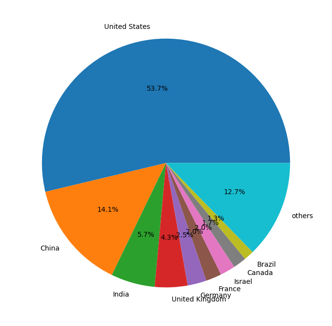
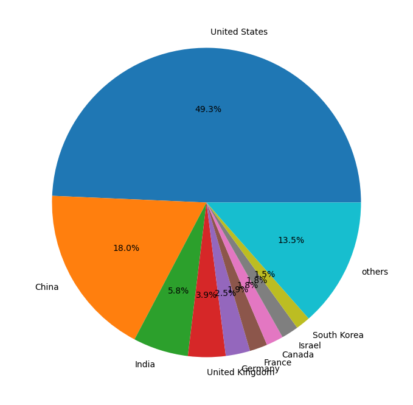

# ¿Que son las empresas unicornio?
Son empresas privadas cuya capitalizacion de mercado supera los mil millo
nes de dolares. Esto se calcula teniendo en cuenta los tratos con inversores privados.

# ¿Unicornios por pais?
Los 3 paises con más conpañias unicornio eran Estados
Unidos, China y la India.
## Resumen de los datos de CB Insight 2023

## Resumen de los datos de Eqvista

# ¿Empresas unicornios en Argentina?
Segun un articulo de La Nacion:
> La Argentina tiene 11 compañías que superaron la valuación de US$1000 millones, aunque algunas ya no son formalmente unicornios, porque ahora tienen oferta pública y sus acciones se transaccionan. Es el caso de MercadoLibre o Globant, las de mayor valuación dedicadas al comercio electrónico y al desarrollo de software. Las otras son: Despegar (turismo), OLX (e-commerce), Auth0 (seguridad informática), Vercel (diseño web), Aleph (publicidad), Mural (equipos de trabajo virtuales), Bitfarms (criptomonedas), Ualá (Fintech) y Tiendanube (e-commerce). Muchas de las valuaciones se dieron en los últimos años, a contramano de una economía que se contraía. 2018 fue el año de mayor numero de acuerdos (42) y 2019 el de mayor monto, con US$400 millones.

Sin embargo no puedo respaldarlo con los datos que encontre mediante diferentes
motores de busqueda. Quiza se pueda hacer una investigacion más a fondo buscando
informacion sobre cada empresa.

***Fuentes***
[Cómo llega una startup a convertirse en un unicornio](https://www.lanacion.com.ar/economia/como-llega-una-startup-a-convertirse-en-un-unicornio-nid22082021/)

[Complete List of Unicorn Companies 2023](https://eqvista.com/complete-list-unicorn-companies/)

[Global unicorn club](https://www.cbinsights.com/reports/CB-Insights_Global-Unicorn-Club_2023.xlsx)
